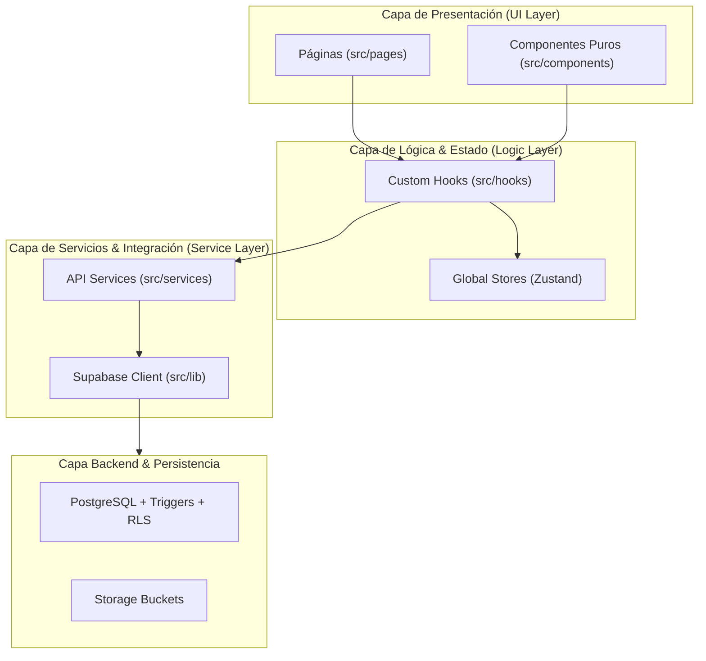

# Guía de Arquitectura y Decisiones Técnicas

Este documento detalla los principios de diseño, la estructura de capas, las decisiones técnicas clave y los patrones arquitectónicos adoptados en **Rifas & Raffles**.

---

## 1. Principios de Diseño y Arquitectura

La arquitectura de la aplicación sigue los principios de **Separación de Responsabilidades (SoC)**, **Alta Cohesión** y **Bajo Acoplamiento**:

### Reglas de Arquitectura:
1. **Componentes Visuales Libres de Lógica de Negocio**: Los componentes y páginas de React (`src/pages`, `src/components`) solo renderizan JSX y capturan eventos del usuario. No realizan consultas a Supabase ni aplican reglas de validación complejas directamente en el cuerpo del componente.
2. **Lógica Encapsulada en Custom Hooks**: Toda validación de formularios, transformaciones de datos, temporizadores y manejo de estados locales vive en `src/hooks/` (`useNumberEditor`, `useRaffleForm`, `useRaffleEdit`, `useProfile`, etc.).
3. **Capa de Servicios Aislada**: Las llamadas a la API y mutaciones a la base de datos se centralizan en `src/services/` (`raffleService.ts`, `profileService.ts`, `raffleNumberService.ts`). Esto permite cambiar de proveedor o agregar capas intermedias sin tocar la interfaz.

---

## 2. Decisiones Técnicas Clave

### A. Autenticación Passwordless con OTP
- **Decisión**: Eliminar contraseñas tradicionales y autenticar únicamente por código de un solo uso enviado al correo electrónico (`signInWithOtp` / `verifyOtp`).
- **Motivación**:
  - Reduce la fricción de onboarding (no hay que recordar credenciales ni implementar flujos de recuperación de contraseña).
  - Maximiza la seguridad al mitigar ataques de fuerza bruta o filtración de claves débiles.

### B. Manejo de Estado Global con Zustand
- **Decisión**: Usar Zustand en lugar de Redux o Context API para el estado de autenticación y tema.
- **Motivación**:
  - Cero boilerplate: no requiere Providers anidados ni reducers verbosos.
  - Subscripciones atómicas por selector: los componentes solo se re-renderizan si cambia la propiedad exacta que consumen (ej. `useAuthStore(state => state.session)`).

### C. Enrutamiento y Lazy Loading (`routes.tsx`)
- **Decisión**: Centralizar las rutas en `src/routes.tsx` separadas de `App.tsx` y utilizar `React.lazy` con `Suspense`.
- **Motivación**:
  - Disminuye drásticamente el tamaño del paquete inicial (Initial Bundle Size).
  - Cada vista solo se descarga cuando el usuario navega a ella.
  - Implementación de guardianes de ruta (`ProtectedRoute` y `PublicOnlyRoute`) para redirecciones predecibles.

### D. Optimización de Rendimiento con `useMemo`
- **Decisión**: Envolver los filtros y búsquedas sobre listas de números en el detalle de la rifa dentro de `useMemo`.
- **Motivación**:
  - Para rifas con cientos o miles de números, evita recalcular colecciones en cada render provocado por eventos ajenos (como toggles visuales o timers).

### E. Sistema de Diseño CSS Modular y Tokenizado
- **Decisión**: Utilizar CSS moderno basado en **Custom Properties (Tokens)** y segmentar las hojas de estilo en módulos temáticos en lugar de un archivo CSS monolítico o frameworks utilitarios que agreguen peso innecesario.
- **Módulos**:
  - `tokens.css`: Definición de variables semánticas (colores, sombras, bordes, tipografía).
  - `auth.css`: Estilos de pantallas de autenticación.
  - `forms.css`: Formularios base y perfil de usuario.
  - `raffle-detail.css`: Tablero numérico interactivo, tablas y filtros.
  - `modals.css`: Ventanas modales y selectores.
  - `image-upload.css`: Componente de subida de imágenes y visualizador de archivos.

---

## 3. Manejo de Errores y Mensajes al Usuario

Se utiliza un mapper centralizado en [`src/lib/errorMessages.ts`](./src/lib/errorMessages.ts) que intercepta errores de red, respuestas de PostgreSQL o Supabase Auth y los transforma en mensajes claros en español comprensibles para el usuario final (traducción de `duplicate key`, `invalid otp`, `rate limited`, etc.).

---

## 4. Prácticas de Código y Tipado

- **TypeScript Estricto**: Tipos explícitos para todas las entidades (`Raffle`, `RaffleNumber`, `Profile`, `NumberStatus`).
- **Inmutabilidad**: Actualización funcional de arrays y objetos en stores y hooks (`setNumbers(prev => prev.map(...))`).
- **Limpieza de Recursos**: Todos los `useEffect` que crean timers, suscripciones o URLs de objetos (`URL.revokeObjectURL`) implementan su respectiva función de limpieza (`cleanup function`).
